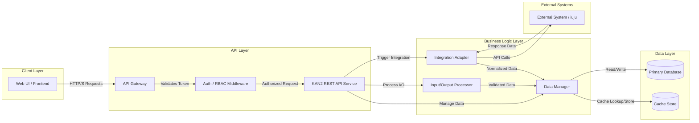
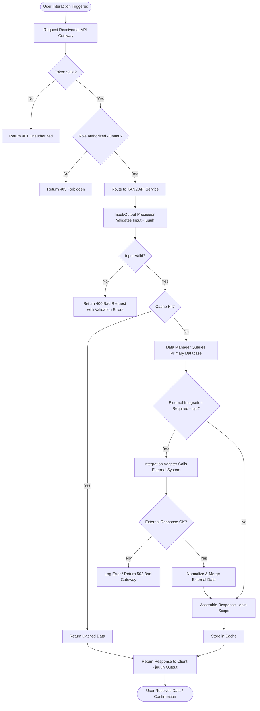

# Architecture — KAN2

## Overview
KAN2 is a role-based data management feature that enables authorized users (ununu) to interact with scoped content (oojn) through a structured input/output interface (juuuh). It integrates with identified external systems (iuju) and is designed for high concurrency, sub-second API response, and strict access control. The architecture follows a layered approach to ensure maintainability, reliability, and performance under load.

## Component Diagram

## Data Flow

## Components

| Component | Responsibility | Technology |
|---|---|---|
| Web UI / Frontend | Presents KAN2 data and captures user interactions; enforces basic client-side validation | React / TypeScript |
| API Gateway | Single entry point; handles TLS termination, rate limiting, and request routing | NGINX / AWS API Gateway |
| Auth / RBAC Middleware | Validates JWT tokens and enforces role-based access for ununu user roles | JWT + OAuth 2.0 |
| KAN2 REST API Service | Orchestrates business logic, delegates to sub-components, returns structured responses | Node.js / Express (or Java Spring Boot) |
| Input/Output Processor | Validates and transforms inputs and outputs per the juuuh specification | JSON Schema / Joi / Zod |
| Data Manager | Abstracts all read/write operations against the database and cache | ORM (Prisma / Hibernate) |
| Integration Adapter | Translates and relays calls to/from the iuju external system; handles retries and error normalization | Axios / Resilience4j |
| Primary Database | Persistent storage for all KAN2-scoped data (oojn) with transactional integrity | PostgreSQL |
| Cache Store | Low-latency read layer to satisfy the 95th-percentile 1-second API response NFR | Redis |
| External System (iuju) | Third-party or existing module integration point — consumed via the Integration Adapter | External (REST / SOAP) |

## Design Decisions

| ID | Decision | Rationale |
|---|---|---|
| DD-01 | Separate RBAC middleware from the API service | Isolates access control concerns; makes policy changes independent of business logic, supporting NFR-05 and NFR-07 |
| DD-02 | Introduce a Redis cache layer | Directly addresses NFR-04 (95% of requests under 1 second) by serving repeated reads without hitting the database |
| DD-03 | Use an Integration Adapter pattern for iuju | Decouples the external system contract from internal logic; enables mock/stub for testing and swap-out without broad refactoring (NFR-07, FR-04) |
| DD-04 | Input/Output Processor as a dedicated component | Centralizes validation of juuuh-specified I/O, ensuring data integrity (NFR-06) and a single place to update when spec changes |
| DD-05 | Stateless API service instances behind the gateway | Enables horizontal scaling to meet the 500-concurrent-user requirement (NFR-03) without session-affinity complexity |
| DD-06 | PostgreSQL as primary data store | ACID compliance guarantees data integrity (NFR-06); mature ecosystem supports maintainability (NFR-07) |
| DD-07 | API Gateway rate limiting | Protects backend services under peak load, supporting the 5-second peak-load response NFR (NFR-02) |

## Tech Stack

| Layer | Choice | Why |
|---|---|---|
| Frontend | React + TypeScript | Component-based UI for intuitive UX (NFR-01); strong typing supports maintainability (NFR-07) |
| API Gateway | NGINX / AWS API Gateway | Battle-tested rate limiting, TLS termination, and horizontal scalability (NFR-02, NFR-03) |
| Auth | OAuth 2.0 + JWT | Industry-standard stateless token auth; maps cleanly to RBAC for role enforcement (NFR-05) |
| Backend API | Node.js + Express (or Java Spring Boot) | High I/O concurrency for 500+ users (NFR-03); large ecosystem for maintainability (NFR-07) |
| Validation | Zod / Joi (Node) or Bean Validation (Java) | Declarative schema validation for I/O integrity (NFR-06, FR-03) |
| Database | PostgreSQL | ACID transactions, relational integrity, proven at scale (NFR-03, NFR-06) |
| Cache | Redis | Sub-millisecond reads; supports 1-second 95th-percentile API target (NFR-04) |
| Integration | Axios + retry/circuit-breaker (or Resilience4j) | Handles transient external failures gracefully; prevents cascade failures (FR-04, NFR-06) |
| Infrastructure | Docker + Kubernetes | Container orchestration for horizontal scaling and zero-downtime deploys (NFR-02, NFR-03) |